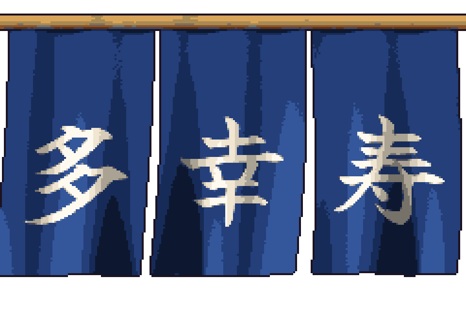
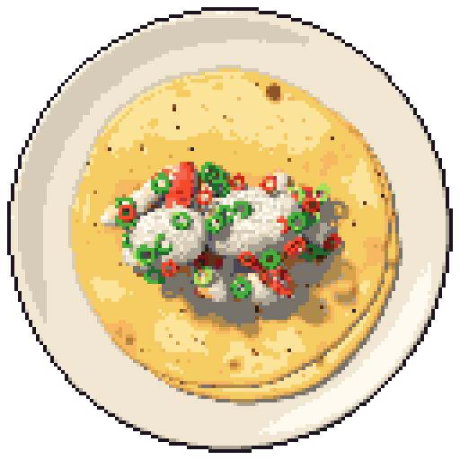

# Oh!Edo Taco Tuesday!!（多幸寿）— ドット絵パイプライン試作

江戸にタイムスリップしたタコス屋の屋台ゲーム「Oh!Edo Taco Tuesday!!」のための試作です。
**Blender の3Dモデルを Python で作り、自動でドット絵に変換する仕組み**を、
タコス1個と開店カットインの暖簾で試しています。画像生成AIは使っていません。





## できるもの

| ファイル | 内容 | サイズ |
|---|---|---|
| `output/taco/taco_top.png` | 具材をのせた開いたタコス（真上） | 128×128 |
| `output/taco/taco_oblique.png` | 同じタコス（斜め上 約45度） | 128×128 |
| `output/taco_fold/taco_fold_00〜07.png` | トルティーヤを折りたたむアニメ（真上・8コマ） | 128×128 |
| `output/taco_fold/taco_fold_x4.gif` | 折りたたみの確認用GIF（4倍に拡大） | 512×512 |
| `output/icons/icon_*.png` | 具材アイコン（鯛・大根おろし・ねぎ・唐辛子） | 32×32 |
| `output/noren/noren_00〜05.png` | 暖簾「多幸寿」がはためくアニメ（6コマでループ） | 240×160 |
| `output/noren/noren_x4.gif` | 暖簾の確認用GIF（4倍に拡大） | 960×640 |
| `preview.html` | 全画像の確認ページ（等倍と4倍・アニメ再生） | — |

すべて背景透過の PNG で、**全画像が同じ32色のパレット**（`pipeline/palette.py`）だけで塗られています。

---

## 使い方（はじめての人向け）

### 0. 準備（最初の1回だけ）

1. このフォルダをエクスプローラーで開きます。
2. 上のアドレスバー（フォルダの場所が表示されている所）をクリックし、`powershell` と入力して Enter を押します。
   黒い（または青い）画面「PowerShell」が開きます。以降のコマンドはここに貼り付けて Enter で実行します。
3. 必要なライブラリを入れます（すでに入っていれば何も起きません）。

   ```
   python -m pip install -r requirements.txt
   ```

4. 環境チェックをします。

   ```
   python check_env.py
   ```

   `すべてOKです。` と出れば準備完了です。

### 1. 全画像を作り直す

```
python build.py
```

1〜2分ほどかかります。終わると `output/` の画像と `preview.html` が新しくなります。

- 色（パレット）だけ変えたときは、レンダリングを省略できて速いです：`python build.py --skip-render`
- 一部だけ作り直す：`python build.py --only icons`（`taco` / `icons` / `noren` をカンマ区切りで指定）

### 2. 確認する

`preview.html` をダブルクリックすると、ブラウザで全画像が等倍と4倍で表示されます。
アニメは再生・一時停止・コマ送りができます。右上のボタンで背景を「夜」と「市松模様」に切り替えられます。

---

## 新しい具材を追加する手順

例として「しその葉（`shiso`）」を追加する場合です。

### 手順1：いちばん簡単な具材のファイルをコピーする

1. `blender/ingredients` フォルダを開きます。
2. `daikon.py`（大根おろし）をコピーして貼り付け、名前を `shiso.py` に変えます。

### 手順2：名前を書き換える

`shiso.py` をメモ帳などで開き、上の方の2行を書き換えます。

```python
NAME = "shiso"          # 英字の名前（ファイル名に使われます。半角英小文字で）
LABEL = "しその葉"       # 確認ページに表示される日本語の名前
```

### 手順3：色を変える

`_material()` の中の `"#ffffff"` などが色です。`(位置, "#色")` の組で、
位置 0.0 の色〜1.0 の色の間でムラ（まだら模様）がつきます。緑にするなら例えば：

```python
    return cached_material("shiso", lambda n: object_noise_material(n, [
        (0.00, "#8ec85a"), (0.50, "#4f9a3a"), (1.00, "#2c602a"),
    ], scale=8.0, roughness=0.5, detail=1.0))
```

- `cached_material("shiso", ...)` の `"shiso"` も新しい名前に変えてください（他の具材と同じ名前だと色が混ざります）。
- 色は最後に32色パレットの一番近い色に置き換わります。パレットにない色味（例：紫）が必要なときは
  `pipeline/palette.py` の色を1つ入れ替えてください（32色を超えるとエラーで止まります）。

### 手順4：形を変える

`_mound(rng, 横, 奥行き, 高さ)` の数字で大きさが変わります（トルティーヤの半径が 1.0 です）。
しその葉なら平たくして `_mound(rng, 0.30, 0.20, 0.02)` のようにします。

- `on_taco()` … タコスの上に置く場所と数。`[(x, y, 大きさ), ...]` の x は左右、y は上下（-0.4〜0.4 くらいが具の範囲）。
- `icon()` … 32×32 アイコン用の形。カメラは自動で大きさに合わせるので、位置は気にしなくて大丈夫です。
- もっと凝った形は `tai.py`（小さなかけらをたくさん積む）や `togarashi.py`（管を曲げて作る）が参考になります。

### 手順5：一覧に登録する

`blender/ingredients/__init__.py` を開き、2か所に `shiso` を足します。

```python
from . import tai, daikon, negi, togarashi, shiso

INGREDIENTS = [
    tai,
    daikon,
    negi,
    togarashi,
    shiso,
]
```

並び順がタコスに盛る順番です（上に書いたものが下に敷かれます）。しそを一番下に敷きたいなら `tai,` の前に書きます。

### 手順6：作り直して確認する

```
python build.py
```

`preview.html` を開き直すと、具材アイコンに「しその葉」が増え、タコスにも盛られています。
うまくいかないときは、PowerShell に出た赤い英語のメッセージ（`Error` の行）をそのまま相談してください。

---

## 見た目の方針（調査メモ）

絵を描く前に本物のタコスの見た目を調べ、次のようにモデルに反映しています。
ゲームなので、色は実物より少し鮮やかにしています。

| 調べたこと | モデルへの反映 |
|---|---|
| 屋台のタコスは直径10cm前後の小さなトウモロコシのトルティーヤを**2枚重ね**で出すのが定番 | トルティーヤを2枚重ね、下の1枚を少しずらして見せる（`blender/taco.py`） |
| 焼き色は明るい黄色の上に**こげ茶の細かい斑点**、膨らんだところが濃く焦げる | ふち一周の焦げをやめ、全体に散る斑点と中くらいの焦げ跡にした（ふちが一周焦げるとピザに見える） |
| 皮は薄く、ふちは盛り上がらない | 厚みを薄くし、ふちはわずかに垂れる形に |
| 具は皮に対して多めにのせる | 具を大きく・多めにし、皮の中央の帯をほぼ覆うように盛る |
| 白い丸皿で出すことが多い | 白い平皿 |
| 鯛は白い身と桜色の皮 | 白いほぐし身の上に薄い桜色の皮をのせる（皮だけの塊はトマトに見えるため） |

出典：
[Chicken Street Tacos（Sandra Valvassori）](https://www.sandravalvassori.com/chicken-street-tacos/)、
[Size Matters: When It Comes to Tacos（San Antonio Current）](https://www.sacurrent.com/food-drink/size-matters-when-it-comes-to-tacos-theres-a-logic-to-the-scale-of-tortilla-you-use-23443971/)、
[Homemade Corn Tortillas（Stellanspice）](https://stellanspice.com/homemade-corn-tortillas/)、
[Homemade Corn Tortillas（Mexican Please）](https://www.mexicanplease.com/homemade-corn-tortillas/)、
[Tacos al Pastor（Gusto TV）](https://gustotv.com/mains/tacos-al-pastor/)

---

## しくみ

```
python build.py
  ├─ pipeline/noren_textures.py … フォントから暖簾の布の模様（藍色に白抜き文字）を作る
  ├─ Blender（画面なしで起動）→ blender/render_all.py
  │    ├─ blender/taco.py         … 2.1 トルティーヤ（2枚重ね）/ 2.3 皿 / 折りたたみ変形
  │    ├─ blender/ingredients/    … 2.2 具材（1種類 = 1ファイル）
  │    ├─ blender/noren.py        … 6. 暖簾（布を波で動かす、6コマでループ）
  │    └─ blender/common.py       … 3. カメラ（真上・斜め45度）と照明（左上から暖色）
  │    → build/renders/ に 4倍サイズの元画像
  ├─ pipeline/pixelate.py … 4. ドット絵変換
  │    ├─ 4.1 縮小：ニアレストネイバー（色を混ぜない）
  │    ├─ 4.2 減色：固定32色パレット（人の目に近い OKLab 色空間で一番近い色）
  │    └─ 4.3 輪郭：絵の外側に 1px の暗い線
  │    → output/ に完成画像と確認用GIF、checksums.txt
  └─ pipeline/preview.py → preview.html
```

- **毎回同じ結果になる工夫**：乱数は名前から作った固定の種（シード）を使い、Blender のレンダリングもノイズの種を固定しています。
  `output/checksums.txt` に全画像の指紋（SHA-256）が書かれるので、作り直して変化がなければ同じ画像です。
- `build/` は途中のファイルなので Git には入れていません（いつでも作り直せます）。

## 困ったとき

- **「Blender が見つかりません」**：Blender を `C:\Program Files\Blender Foundation\` 以外に入れた場合です。
  PowerShell で次のように場所を教えてから実行してください（パスは自分の環境に合わせて変えます）。

  ```
  $env:BLENDER = "D:\Apps\Blender\blender.exe"
  python build.py
  ```

- **`python` が見つからない**：Python をインストールし、インストール時に「Add python.exe to PATH」にチェックを入れてください。

## ライセンス

使用フォント（Yuji Syuku / SIL OFL 1.1）などは [LICENSES.md](LICENSES.md) を見てください。
